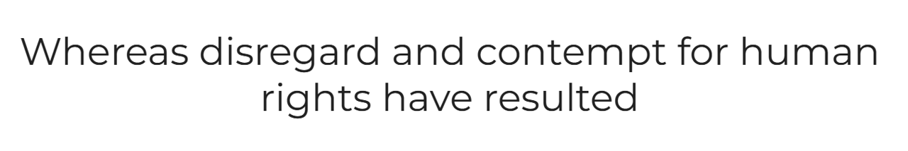

#  MS2 project-loan-and-accommodation-cost

I thougth that an easily accessible calculator should be god to have when you are about to buy a new home. When I started to draw the wire frame for this i got quit big with alot of calculation and my thought was also that you should be able to calculate your tax when you sold one home and bought a new and many more things. What I also whanted to get in was statistics whit some grafs.
I started big in my mind and looked around how i should build this but the time ran away for me and it resulted in this small calculator due to the time and also because things that I thuoght was easy where much more tricky and time consuming that I first thought. 

[View Loan & accomendation cost on Github Pages](https://github.com/AnnikaW-dev/loan-and-accommodation-cost)

[View Loan & accomendation cost on the web](https://annikaw-dev.github.io/loan-and-accommodation-cost/)

---

## CONTENTS

* [User Experience](#user-experience-ux)
  * [User Stories](#user-stories)

* [Design](#design)
  * [Colour Scheme](#colour-scheme)
  * [Typography](#typography)
  * [Imagery](#imagery)
  * [Wireframes](#wireframes)

* [Features](#features)
  * [General Features on Each Page](#general-features-on-each-page)
  * [Future Implementations](#future-implementations)
  * [Accessibility](#accessibility)

* [Technologies Used](#technologies-used)
  * [Languages Used](#languages-used)
  * [Frameworks, Libraries & Programs Used](#frameworks-libraries--programs-used)

* [Deployment & Local Development](#deployment--local-development)
  * [Deployment](#deployment)
  * [Local Development](#local-development)
    * [How to Fork](#how-to-fork)
    * [How to Clone](#how-to-clone)

* [Testing](#testing)

* [Credits](#credits)
  * [Code Used](#code-used)
  * [Content](#content)
  * [Media](#media)
  * [Acknowledgments](#acknowledgments)

---

## User Experience (UX)

### Initial Discussion
I thougth that an easily accessible calculator should be god to have when you are about to buy a new home. When I started to draw the wire frame for this i got quit big with alot of calculation and my thought was also that you should be able to calculate your tax when you sold one home and bought a new and many more things. What I also whanted to get in was statistics whit some grafs.
I started big in my mind and looked around how i should build this but the time ran away for me and it resulted in this small calculator due to the time and also because things that I thuoght was easy where much more tricky and time consuming that I first thought. 

This is a start up site that will grow to what I first wanted it to be, I also want to be able to let the users login and save there data and makes life much esier when you plan to buy or change home.

### User Stories

#### Buyer that starts to plan to buy a home
Would like to in an easy way put in all the numbers for the new home to se if it is affordable.
Would like to see how much it differs in cost due to the down-payment
Would like be easy to retrive and check during ongoing bidding
#### House broker 
Want to be able to show all this figures for the custumer how the monthly cost differs due to interestrate, price and down payment.  
Want a tool that they can share with the costumer due to that will be easier to talk by phone when they can have the same tool.
### House owner that want to replace the loan or increase the loan 
Want to have an easy app to be able to play around with the figure to see how the monthly cost will be affected. 
Want a tool that helps to be able to take good decisions.

## Design

### Colour Scheme

I choosed those colurs due to that I think that many calculating sites is a litte to strict and often very cold colours. I like soft and warm colours so thats why I chose this colours-

### Typography

I chose the font family Montserrat due to that I think it is plan and easy to read. 

### Imagery

The only images I have used for this website is the Favicon that i got from [favicon.io](https://favicon.io/emoji-favicons/#google_vignette)

### Wireframes

Wireframes were created for mobile, tablet, and desktop

[Shows the wireframes for desktop](doc/readme_images/wireframe_desktop.png)

[Shows the wireframes for mobile page](doc/readme_images/wireframe_mobile.png)

## Features

Loan & accomendation cost have a input part there I have use range sliders to just drag to the right amount that you need and when you have the right figures you click on the button to get the calculation result
 

I then like to add a screenshot of each page of the site here, i use [amiresponsive](https://ui.dev/amiresponsive) which allows me to grab an image of the site as it would be displayed on mobile, tablet and desktop, this helps to show the responsiveness of the site.

### Future Implementations

* In the future ia would like to:

   *Add login for members  

   * More caculation of tax then you sell.

   *Caculation of deferral

   * Calculate of the sales profit / loss

   *That members can save the calulations 
### Accessibility

I have had the accessibillity inmind through the procces of building YogaPause by:

* Used sematic HTML

* I havee ensured to meet the minimum contrst reuirements by test with [WAVE](https://wave.webaim.org/) (see the result in the test section)

* I have chosen the fonts with the readabillity in mind.

## Technologies Used

### Languages Used

HTML, CSS and JavaScript was used to create this site.

### Frameworks, Libraries & Programs Used

Balsamiq - was used to creat the wireframes.

Github - to save and store files.

Google Fonts - to implement the fonts used.

Chrome Dev tools - To se the responsivness and styling.

Favicon.io - To get favicons.

[amiresponsive](https://ui.dev/amiresponsive)  - To show website images on differens devices.

## Deployment & Local Development

### Deployment
Github Pages was used to deploy the live website. The instructions to achieve this are below:

1. Log in (or sign up) to Github.
2. Find the repository for this project, AnnikaW-dev/YogaPause.
3. Click on the Settings link.
4. Click on the Pages link in the left hand side navigation bar.
5. In the Source section, choose main from the drop down select branch menu. Select Root from the drop down select folder menu.
6. Click Save. Your live Github Pages site is now deployed at the URL shown.

#### How to Fork

To fork the Loan & accomendation cost repository:

1. Log in (or sign up) to Github.
2. Go to the repository for this project, AnnikaW-dev/Loan & accomendation cost.
3. Click the Fork button in the top right corner.

#### How to Clone

To clone the Loan & accomendation cost repository:

1. Log in (or sign up) to GitHub.
2. Go to the repository for this project, AnnikaW-dev/Loan & accomendation cost.
3. Click on the code button, select whether you would like to clone with HTTPS, SSH or GitHub CLI and copy the link shown.
4. Open the terminal in your code editor and change the current working directory to the location you want to use for the cloned directory.
5. Type 'git clone' into the terminal and then paste the link you copied in step 3. Press enter.

## Testing

### Lighthouse Testing

### WAVE testing

### W3C HTML checker

### Jigsaw w3 CSS Checker

### Manuel Testing

* Responsivness - Tested on Chrome Dev Tool during the developpment to make sure it was ok - OK

* Button
* Range-slider
* Calculatons
* 
*

## Validator Testing

I did validator testing for the page and got some errors:
* Wave 
 * For use the missing h1 header (from Wave)

#### W3C_html_checker
 * Element link is missing one or more of attributes
 * Attribute size not allowed on element link 
 * Stray endtag span
 * Garbage after </>

#### Jigsaw_w3_CSS_code_checker
 *.container2: 1fr is not aflex value
 * #calculator-btn:hover: 0.2 is not a transition value
 * #reset-btn:hover 0.2 is not a not a transition value
 * -webkit-apperance is not a is not a known provider  of extension
* ::webkit-slider-thumb is not a known name of a vendor-specific pseudo-element

All this Errors was easy to find and fix.

## Credits

### Content

I have writen all the code by my self with a little help from google and chat-gpt when the code didnt work as I expected.

###  Acknowledgments

My Code Intitute Mentor Gareth Mc Girr for all links and for the support.

My Two dogs Rocky and Ineze for there patience when I sitt infront of the computer to long.